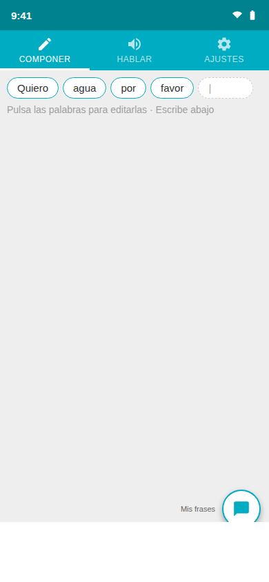
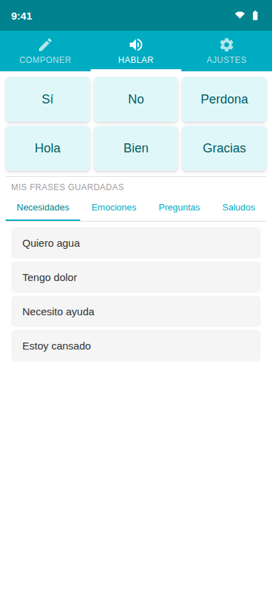
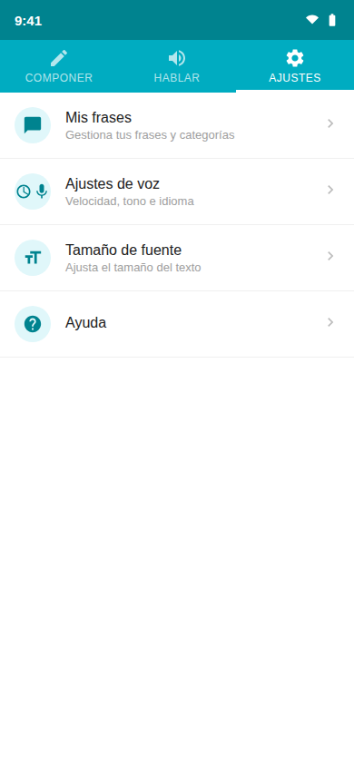

# Conversando

**Conversando** es una aplicación de comunicación aumentativa y alternativa (CAA) para Android e iOS, diseñada especialmente para personas con ELA (Esclerosis Lateral Amiotrófica) y otras condiciones que afectan a la movilidad y el habla.

Funciona completamente **sin servidor** — todo el procesamiento de voz y el almacenamiento de frases ocurre en el dispositivo.

---

## Funcionalidades

### COMPONER — Escribe y habla
Escribe libremente y pulsa el botón de voz para que el dispositivo lo lea en voz alta. Las palabras aparecen como fichas editables para corregir o borrar con un solo toque. Comparte el texto o guárdalo como frase rápida.

### HABLAR — Botones de frase rápida
Botones grandes de un solo toque para frases de uso frecuente (Sí, No, Hola, Gracias…). Debajo, acceso directo a tus frases guardadas organizadas por categorías.

### AJUSTES — Personalización
- **Mis frases**: crea y edita categorías y frases personalizadas con pictogramas o texto fácil
- **Ajustes de voz**: velocidad, tono e idioma (español de España, México, Argentina; catalán)
- **Tamaño de fuente**: ajusta el tamaño del texto con vista previa en tiempo real
- **Ayuda**: guía de uso

---

## Capturas de pantalla

| COMPONER | HABLAR | AJUSTES |
|:---:|:---:|:---:|
|  |  |  |

---

## Tecnología

| Capa | Tecnología |
|---|---|
| Framework | Flutter 3.x (Dart ≥ 3.0) |
| Voz (TTS) | `flutter_tts ^4.0` — procesamiento 100% local, sin API externa |
| Almacenamiento | `shared_preferences ^2.2` — datos guardados en el dispositivo |
| Compartir | `share_plus ^9.0` |
| Android mín. | API 21 (Android 5.0) |
| iOS mín. | iOS 12 |

---

## Instalación y ejecución

### Requisitos
- Flutter SDK ≥ 3.0 ([flutter.dev](https://flutter.dev/docs/get-started/install))
- Android Studio / Xcode para emuladores, o un dispositivo físico

### Pasos

```bash
git clone https://github.com/redela-investigacion/conversando-flutter.git
cd conversando-flutter
flutter pub get
flutter run
```

### Tests

```bash
flutter test
```

69 tests cubren modelos, servicio de almacenamiento, utilidades de texto, lógica de contexto y widgets.

---

## Arquitectura

```
lib/
├── main.dart            # Punto de entrada, inicializa StorageService
├── models.dart          # Phrase, Category, AppSettings (puro Dart)
├── storage_service.dart # Capa de abstracción sobre SharedPreferences
├── text_utils.dart      # tokenize() — tokenizador para el compositor
├── context.dart         # InheritedWidget de estado global (TTS + frases)
├── homePage.dart        # TabBar principal (3 pestañas)
├── composer.dart        # Pestaña COMPONER
├── speaker.dart         # Pestaña HABLAR
├── settings.dart        # Pestaña AJUSTES (voz, fuente, frases)
├── composerField.dart   # Campo de texto con fichas de palabras
├── selectPhrase.dart    # Selector de frases guardadas
├── managePhrase.dart    # CRUD de frases y categorías
└── ...
test/
├── models_test.dart          # 19 tests — Phrase, Category, AppSettings
├── storage_service_test.dart #  9 tests — SharedPreferences mock
├── text_utils_test.dart      # 11 tests — tokenize()
├── context_test.dart         # 18 tests — lógica TTS y frases
└── widget_test.dart          #  7 tests — widgets y navegación
```

---

## Accesibilidad

La app está diseñada para personas con movilidad reducida:
- Botones de al menos 56 dp de alto (recomendación WCAG para objetivos táctiles)
- Etiquetas `Semantics` en todos los botones de icono para lectores de pantalla
- Tipografía Montserrat con tamaño ajustable (12–32 dp)
- Modo de frases rápidas de un solo toque sin necesidad de teclado

---

## Licencia

Proyecto de la Fundación REDELA para la investigación sobre ELA.
